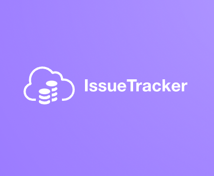

# Issue Tracker 
<br />
<p align="center">
    
    <h3 align="center">Track and manage Issues Effectively</h3>

  <p align="center">
    <a href="mailto:klim30@jh.edu?subject=Mail from Our Site">Report Bug</a>
    ·
    <a href="mailto:dyang40@jh.edu?subject=Mail from Our Site">Request Feature</a>
    ·
    <a href="https://issue-track3r.herokuapp.com">Heroku Demo 🚀</a>
  </p>
      <p align="center">  IssueTracker is an intuitive and user-friendly issue (aka tickets, bugs, etc...) management tool for collaborators who are working in overlapping projects including software developers and students. </p>
</p>

## What can Issue Tracker do?
The IssueTracker allows users to create projects and add other users to the project. Within each project, users can create and assign issues to other members of the project. Each user can easily access and manage their issues. They will also have a comprehensive overview of their on-going projects and status of the issues within each of their projects. 

## Motivation 
As prospective software developers/Computer Science students at Johns Hopkins University, we have tackled numerous projects in and out of the classrooms. While there were numerous services like github and Jira that aids the collaboration process, we found it rather challenging at the beginning for students like us to fully utilize the complex features of those services, and felt the need for a simple and intuitive issue management tool for developers as well as, really, any group of people who are involved in overlapping projects. 

## Tech Stack

| Stack   | -                                                                                                   | -                                                                                                  | -                                                                                                 | -                                                                                                | -                                                                                                                | -                                                                                                   |                                                       
| -------- | -------------------------------------------------------------------------------------------------- | ------------------------------------------------------------------------------------------------- | ------------------------------------------------------------------------------------------------ | ---------------------------------------------------------------------------------------------------------------- | --------------------------------------------------------------------------------------------------- | --------------------------------------------------------------------------------------------------- | 
| FrontEnd | <p align="center"> <br />Javascript</p> | <p align="center"> <br />CSS</p>  | <p align="center"> <br />HTML</p>   | <p align="center"> <br />Handlebars Template Engine</p> |      |
| BackEnd  | <p align="center"> <br />Nodejs</p>   | <p align="center"> <br />Heroku</p> | <p align="center"> <br />PostgreSQL</p> | <p align="center"> <br />Express</p>               | <p align="center"> <br />Passport</p> |<p align="center"> <br />Sequelize</p> | 


## Creators 

-  ### [Dokyung Yang](https://github.com/dokker19) (Full-Stack, Product Design and Management)
    [](https://www.linkedin.com/in/dokyung-yang-679a1b19a/)

- ### [Kyoungjin Lim](https://github.com/jinny0909) (Front-End and UI/UX Design)
    [](https://www.linkedin.com/in/kyoungjin-lim-549173205/)

## :rocket: Quick start - Start running locally

### Step 1: Clone the repo
Clone the repo locally by doing -

```sh
git clone https://github.com/dokker19/IssueTracker.git
```

### Step 2: Install Dependencies
cd into the directory

```sh
cd IssueTracker
```

In the root folder do npm install.
```sh
npm install

```

### Step 3: Run the server 
```sh
npm run dev
```


## :open_file_folder: Folder Structure 
        
    .
    ├── client
    |   ├─public/css
    │   └─views 
    |       ├───layouts
    └── server
        │
        ├───controllers
        ├───express
        ├───routes
        ├───sequelize 

## **Commit Convention**

- [feat]: new feature
- [bug]: bug fix
- [fix]: layout or feature fix 
- [style]: code formatting
- [refactor]: code refactoring 
- [test]: test code 
- [chore]: build tasks 
- [perf]: performance improvement
- [docs] : documentation
